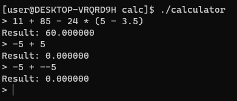

[English version](README.md)

# Cross-Platform Assembly Calculator

Кроссплатформенный консольный калькулятор, написанный с нуля на ассемблере x86-64 с использованием синтаксиса MASM/UASM.




## Особенности

- **Базовые арифметические операции:** Сложение (`+`), вычитание (`-`), умножение (`*`), деление (`/`).
- **Приоритет операций:** Корректная обработка порядка вычислений (умножение и деление выполняются раньше сложения и вычитания).
- **Поддержка скобок:** Возможность изменять порядок операций с помощью круглых скобок.
- **Унарный минус:** Поддержка отрицательных чисел и выражений вида `5 * -2`.
- **Числа с плавающей запятой:** Все вычисления производятся с 64-битными числами (`double`) с использованием SSE2 инструкций.
- **Обработка деления на ноль:** Возвращает `inf` (бесконечность) в соответствии со стандартом IEEE 754.
- **Кроссплатформенность:** Код компилируется под Linux и может быть легко адаптирован для Windows благодаря использованию стандартной библиотеки C (libc/MSVCRT).

## Архитектура

Проект имеет чистую модульную архитектуру, разделяющую обязанности между компонентами:

1.  **`lexer.asm` (Лексер):** Отвечает за лексический анализ. Преобразует входную строку в последовательность токенов (числа, операторы, скобки).
2.  **`parser` (Парсер, в `calculator.asm`):** Отвечает за синтаксический анализ. Использует алгоритм **сортировочной станции (Shunting-yard)** для преобразования последовательности токенов в Обратную Польскую Нотацию (ОПН), учитывая приоритеты операторов и скобки.
3.  **`evaluator.asm` (Вычислитель):** Выполняет вычисление выражения, представленного в ОПН, используя стековый калькулятор.
4.  **`calculator.asm` (Главный модуль):** Управляет всем процессом: получает ввод пользователя, вызывает модули по очереди и выводит финальный результат.
5.  **`common.inc`:** Общий заголовочный файл с определением структуры `Token`.

## Сборка и запуск

**Требования:**
- Ассемблер `UASM` (версия 2.57+)
- Компилятор `GCC` (для линковки)

**Инструкция по сборке:**

Для удобства в репозитории есть скрипт `build.sh`.

1.  Сделайте скрипт исполняемым:
    ```bash
    chmod +x build.sh
    ```
2.  Запустите скрипт:
    ```bash
    ./build.sh
    ```
    Он автоматически скомпилирует все модули и слинкует их в один исполняемый файл `calculator`.

**Ручная сборка:**
```bash
# 1. Ассемблируем все модули
uasm -elf64 lexer.asm
uasm -elf64 evaluator.asm
uasm -elf64 calculator.asm

# 2. Линкуем объектные файлы с помощью GCC
gcc -no-pie calculator.o lexer.o evaluator.o -o calculator -lm
```

**Запуск:**
```bash
./calculator
```
---
**Лицензия:** MIT
